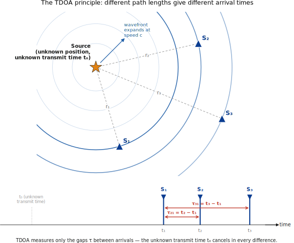
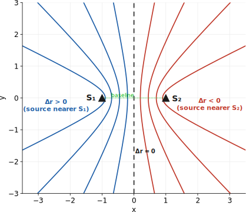
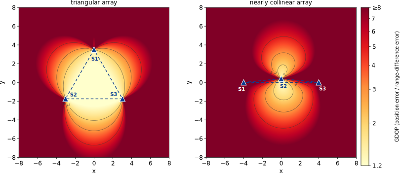

.. _tdoa-chapter:

####
TDOA
####

Time Difference of Arrival (TDOA) is a technique that localizes an emitter from differences in signal arrival time across synchronized sensors, without needing the transmitter's clock. This chapter covers the full TDOA pipeline, geometry, GCC-PHAT time-delay estimation, closed-form and maximum-likelihood localization, accuracy bounds (CRLB and GDOP), and challenges like synchronization and multipath.  TDOA can be used in RF, acoustic, and sonar geolocation.

************
Introduction
************

A recurring problem across acoustics, radio engineering, and defense systems is this: a source emits a signal, several spatially separated sensors receive it, and we wish to recover the source's position from those received signals alone. The source may be cooperative (a cell phone trying to be found) or non-cooperative (a radar emitter that would rather not be), stationary or moving, and the medium may be air, water, or free space. Despite this diversity, the geometry and estimation theory that solve the problem are remarkably uniform, and *Time Difference of Arrival* (TDOA) sits at the center of them.

TDOA-based localization appears in cellular emergency-caller location, acoustic with microphone arrays (e.g., gunshot-detection systems mounted on city streetlights), passive sonar, passive (non-emitting) radar, electronic warfare and signals intelligence, and even wildlife tracking. In each case the engineering details differ, but the mathematical skeleton is the same one developed in this chapter.

******************
TDOA in a Nutshell
******************

Consider the propagation time from a source to sensor :math:`i`, namely :math:`t_i = t_0 + r_i / c`, where :math:`t_0` is the (unknown) instant of transmission, :math:`r_i` is the source-to-sensor distance, and :math:`c` is the propagation speed. If we subtract the arrival times at two sensors,

.. math::

   \tau_{ij} = t_i - t_j = \frac{r_i - r_j}{c},

the unknown :math:`t_0` vanishes, which is good because we will likely never know :math:`t_0`. The TDOA depends only on the *difference* of ranges, which depends only on source and sensor geometry. This single fact is why TDOA dominates for non-cooperative emitters: we never need to know when the source transmitted, only that the same wavefront reached our synchronized receivers at measurable relative delays.

The price we pay is that the receivers must share a precise common time reference — a requirement that, as Section 7.8 shows, is itself a demanding engineering problem because a timing error of one nanosecond corresponds to about 0.3 m of range error.

*************************
Geometric Foundations
*************************

From Time Difference to Range Difference
===============================================

Multiplying a measured time difference by the propagation speed converts it into a *range difference*:

.. math::

   \Delta r_{ij} = c\,\tau_{ij} = r_i - r_j .

This is the quantity we actually localize with. For acoustic problems :math:`c \approx 343` m/s in air; for radio problems :math:`c \approx 2.998\times10^8` m/s. Note immediately the consequence for accuracy: in air, a :math:`0.1` ms timing error is only :math:`\sim`\3 cm, whereas in free space the same timing error is 30 km. Radio TDOA therefore demands extraordinarily precise timing, a theme we return to repeatedly.

The diagram below shows an example of an emitter and three sensors, with a time domain plot of the signal being received by each sensor at different times.

The Hyperbola
===================

Fix two sensors at positions :math:`\mathbf{s}_i` and :math:`\mathbf{s}_j`, the *foci*. The set of source positions :math:`\mathbf{u}` consistent with a measured range difference satisfies

.. math::

   |\mathbf{u}-\mathbf{s}_i| - |\mathbf{u}-\mathbf{s}_j| = \Delta r_{ij} = \text{constant}.

This is the defining property of a **hyperbola** (in 3D, a hyperboloid of two sheets): the locus of points whose *difference* of distances to two fixed foci is constant. Several features matter in practice:

* The constant equals :math:`2a`, where :math:`a` is the hyperbola's semi-transverse axis, so :math:`|\Delta r_{ij}| < |\mathbf{s}_i - \mathbf{s}_j|` always — a range difference can never exceed the baseline between the sensors. Measurements that violate this bound signal an error (noise, multipath, or a synchronization fault).
* The *sign* of :math:`\Delta r_{ij}` selects which of the two branches the source lies on (the branch nearer the closer sensor).
* As :math:`|\Delta r_{ij}| \to |\mathbf{s}_i-\mathbf{s}_j|`, the hyperbola degenerates toward the baseline ray; as :math:`\Delta r_{ij}\to 0`, it flattens into the perpendicular bisector of the baseline. Geometry near these extremes is ill-conditioned.

A single TDOA thus constrains the source to a curve, not a point. To fix a position we intersect several such curves.  Below we plot two sensors, and several hyperbola branches drawn for :math:`\Delta r < 0`, :math:`\Delta r = 0` (the perpendicular bisector), and :math:`\Delta r > 0`.  On each hyperbola, the TDOA between the two sensors is constant.  If you calculated the TDOA with just two sensors, you would know it is somewhere on that line but you would need a third sensor to get more specific.

Multilateration
=====================

With :math:`N` sensors we can form pairs and intersect their hyperbolae; the source lies at (or near) their common intersection. This process is **hyperbolic multilateration**. Counting degrees of freedom tells us how many sensors we need:

* In **2D** the source has 2 unknowns :math:`(x,y)`. Each independent TDOA gives one equation, so we need at least 2 independent TDOAs, which requires **3 sensors**.
* In **3D** the source has 3 unknowns :math:`(x,y,z)`, requiring 3 independent TDOAs and therefore **4 sensors**.

In the noiseless, exactly-determined case the hyperbolae meet at a single point (with an occasional geometric ambiguity resolved by branch signs or an extra sensor). With more sensors than the minimum the system is *overdetermined*: noisy hyperbolae no longer share an exact common point, and we must solve a least-squares or maximum-likelihood problem (Sections 7.5-7.6).

Reference Sensor and Independent Pairs
=============================================

From :math:`N` sensors one can form :math:`\binom{N}{2}` pairwise TDOAs, but they are not all independent. Choosing one sensor as a **reference** (say sensor 1) and forming :math:`\tau_{i1}` for :math:`i = 2,\dots,N` yields :math:`N-1` TDOAs from which every other pairwise difference can be reconstructed, since :math:`\tau_{ij} = \tau_{i1} - \tau_{j1}`. These :math:`N-1` are the *independent* measurements that carry all the geometric information.

The redundant pairs are not worthless, however. Because each measured TDOA carries independent *noise*, using all :math:`\binom{N}{2}` pairs (with a correctly modeled, correlated noise covariance — the reference sensor's noise is common to every :math:`\tau_{i1}`) can improve the estimate. For clarity of exposition we develop the algorithms with the reference-sensor formulation and note where the full covariance enters.

Example: A Three-Sensor 2D Fix
============================================

Place three sensors at

.. math::

   \mathbf{s}_1=(0,0),\quad \mathbf{s}_2=(100,0),\quad \mathbf{s}_3=(0,100)\ \text{(meters)},

and suppose the true source is at :math:`\mathbf{u}=(40,30)`. The source-to-sensor distances are

.. math::

   r_1=\sqrt{40^2+30^2}=50,\quad
   r_2=\sqrt{60^2+30^2}=\sqrt{4500}\approx 67.08,\quad
   r_3=\sqrt{40^2+70^2}=\sqrt{6500}\approx 80.62 .

Taking sensor 1 as reference, the range-difference measurements are

.. math::

   \Delta r_{21}=r_2-r_1\approx 17.08\ \text{m},\qquad
   \Delta r_{31}=r_3-r_1\approx 30.62\ \text{m}.

Each defines a hyperbola with foci :math:`\{\mathbf{s}_2,\mathbf{s}_1\}` and :math:`\{\mathbf{s}_3,\mathbf{s}_1\}` respectively; their intersection is the source. Solving the two hyperbola equations by hand is awkward, which is precisely the motivation for the algebraic linearization of Section 7.5 — where we will recover :math:`(40,30)` from exactly these numbers in closed form.

*************************************
The Signal and Measurement Model
*************************************

Received-Signal Model
============================

Let :math:`s(t)` be the (unknown) source waveform. Sensor :math:`i` receives an attenuated, delayed, noise-corrupted copy:

.. math::

   x_i(t) = a_i \, s(t - t_i) + n_i(t), \qquad i = 1,\dots,N,

where :math:`a_i` is a real (or complex, for passband signals) gain capturing propagation loss and antenna response, :math:`t_i = t_0 + r_i/c` is the absolute arrival time, and :math:`n_i(t)` is additive noise. This model assumes a single dominant line-of-sight path; multipath and non-line-of-sight effects are deferred to Section 7.8.

Defining the TDOA
========================

The pairwise TDOA is the difference of arrival times,

.. math::

   \tau_{ij} = t_i - t_j = \frac{r_i - r_j}{c} = \frac{|\mathbf{u}-\mathbf{s}_i| - |\mathbf{u}-\mathbf{s}_j|}{c}.

The right-hand side makes explicit that the TDOA is a nonlinear function of the source coordinates :math:`\mathbf{u}`. The *measurement* problem (Section 7.4) is to estimate :math:`\tau_{ij}` from the waveforms :math:`x_i, x_j`; the *localization* problem (Sections 7.5-7.6) is to invert the nonlinear map from :math:`\mathbf{u}` to the collection of TDOAs.

Noise Assumptions
========================

The standard working assumptions are that each :math:`n_i(t)` is zero-mean, wide-sense stationary, Gaussian, and statistically independent of the source signal and of the noise at other sensors. The per-sensor signal-to-noise ratio is

.. math::

   \mathrm{SNR}_i = \frac{a_i^2 \sigma_s^2}{\sigma_{n_i}^2},

with :math:`\sigma_s^2` and :math:`\sigma_{n_i}^2` the signal and noise powers. These assumptions are idealizations — real noise is often colored and partially correlated across sensors — but they yield tractable estimators and tight bounds that perform well in practice, and the framework extends to a general noise covariance when needed.

The Nonlinear Measurement Equations
==========================================

Collecting the :math:`N-1` reference-based range differences into a vector :math:`\mathbf{m}` with entries :math:`m_i = c\,\tau_{i1} = r_i - r_1`, the noiseless model is

.. math::

   \mathbf{m} = \mathbf{h}(\mathbf{u}), \qquad
   h_i(\mathbf{u}) = |\mathbf{u}-\mathbf{s}_i| - |\mathbf{u}-\mathbf{s}_1|,

and the noisy measurement is :math:`\tilde{\mathbf{m}} = \mathbf{h}(\mathbf{u}) + \boldsymbol{\varepsilon}`, where :math:`\boldsymbol{\varepsilon}` is the range-difference error induced by the time-delay estimation errors of Section 7.4. The function :math:`\mathbf{h}` is nonlinear because of the Euclidean norms, and this nonlinearity is the source of every algorithmic complication that follows. Two broad strategies address it: algebraically *linearize* by introducing an auxiliary variable (Section 7.5), or *iteratively* linearize about a current estimate (Section 7.6).

*************************************************
Time-Delay Estimation (the Measurement Front End)
*************************************************

Before any geometry can be exploited we must extract the delays :math:`\tau_{ij}` from the raw waveforms. This is the *time-delay estimation* (TDE) problem, and its accuracy ultimately caps the accuracy of the entire system.

Cross-Correlation
========================

The natural estimator exploits the fact that :math:`x_i` and :math:`x_j` are noisy, shifted copies of the same waveform. Their cross-correlation,

.. math::

   R_{x_i x_j}(\tau) = \mathbb{E}\!\left[ x_i(t)\, x_j(t+\tau) \right],

is maximized when the shift :math:`\tau` aligns the two copies, i.e. at :math:`\tau = \tau_{ij}`. The estimator is therefore

.. math::

   \hat{\tau}_{ij} = \arg\max_{\tau} \, \hat{R}_{x_i x_j}(\tau),

with the sample cross-correlation computed from a finite record of length :math:`T`. Under the independent-noise assumption the noise contributes no systematic peak, so the correlation peak rides on the signal alignment. In practice the correlation is computed efficiently in the frequency domain via the FFT, using the cross-power spectral density :math:`G_{x_i x_j}(f) = \mathcal{F}\{R_{x_i x_j}(\tau)\}` and an inverse transform.

The Generalized Cross-Correlation Framework
==================================================

Plain cross-correlation is fragile: if the source spectrum is concentrated or the channel is reverberant, the correlation peak is broad and easily shifted by noise. Knapp and Carter's *Generalized Cross-Correlation* (GCC) addresses this by inserting a frequency weighting :math:`\Psi(f)` before transforming back to the lag domain:

.. math::

   R^{\mathrm{GCC}}_{x_i x_j}(\tau) = \int_{-\infty}^{\infty} \Psi(f)\, G_{x_i x_j}(f)\, e^{j 2\pi f \tau}\, df .

The weighting reshapes the spectrum to sharpen and stabilize the peak. Different choices of :math:`\Psi(f)` correspond to different classical estimators, and selecting it well is the heart of robust TDE.

Weighting Functions
==========================

Common weightings include:

* **Cross-correlation** (:math:`\Psi = 1`): the maximum-likelihood choice only in the high-SNR, broadband-flat limit; otherwise suboptimal.
* **Roth** (:math:`\Psi = 1/G_{x_i x_i}(f)`): suppresses frequencies where one sensor is noisy.
* **SCOT** (Smoothed Coherence Transform, :math:`\Psi = 1/\sqrt{G_{x_i x_i}G_{x_j x_j}}`): symmetric whitening of both channels.
* **PHAT** (Phase Transform, :math:`\Psi = 1/|G_{x_i x_j}(f)|`): the most widely used choice in acoustics.

The **GCC-PHAT** estimator deserves emphasis. By dividing out the magnitude of the cross-spectrum it retains *only the phase*:

.. math::

   R^{\mathrm{PHAT}}_{x_i x_j}(\tau) = \int \frac{G_{x_i x_j}(f)}{\bigl|G_{x_i x_j}(f)\bigr|} e^{j2\pi f \tau} df .

Because the delay between two copies of a signal is encoded entirely in the *linear phase* term :math:`e^{-j2\pi f \tau_{ij}}`, while the magnitude carries the (often unhelpful) spectral shape and reverberant coloring, whitening to unit magnitude weights every frequency equally and produces a sharp, near-impulsive peak at the true delay. This makes PHAT strikingly robust to reverberation. Its weakness is that it also whitens noise-dominated frequencies, so at low SNR the equal weighting amplifies noise; SNR-aware variants reintroduce a coherence-based weighting to compensate.

Resolution and Sub-Sample Estimation
==========================================

With sampling rate :math:`f_s`, the correlation is computed on a lag grid spaced :math:`1/f_s` apart, so the naive peak resolution is one sample, i.e. :math:`c/f_s` in range. This is usually far too coarse. Sub-sample refinement fits a model to the samples around the discrete peak — parabolic interpolation through the peak and its two neighbors is the simplest, while sinc-based interpolation is more accurate because the true correlation of a band-limited signal is a sinc-like function. Good interpolation routinely yields delay estimates one to two orders of magnitude finer than the sample period.

Practical Considerations
================================

Several effects govern real performance. The **integration window** :math:`T` trades estimator variance (longer is better, since variance falls roughly as :math:`1/T`) against the assumption of stationarity and, for moving sources, against blurring of the delay over the window. **Coherence bandwidth** limits which frequencies actually carry usable phase. **Signal bandwidth** is decisive: as the Cramér-Rao analysis of Section 7.7 shows, delay variance falls as the *square* of the RMS bandwidth, so wideband signals localize far better than narrowband ones. Finally, the entire computation is dominated by FFTs and is therefore :math:`O(M\log M)` per sensor pair for records of :math:`M` samples, which is what makes large microphone arrays and dense sensor networks tractable.

Worked Example: GCC-PHAT in Practice
============================================

Suppose two microphones sample at :math:`f_s = 48` kHz a transient whose true inter-microphone delay is :math:`\tau_{12} = 0.521` ms. In samples this is :math:`0.521\times10^{-3}\times 48000 \approx 25.0` samples. The processing chain is: (1) take an :math:`M`-point FFT of each record; (2) form the cross-spectrum :math:`X_1(f)\,X_2^*(f)`; (3) divide by its magnitude to apply PHAT; (4) inverse-FFT to obtain the lag-domain function; (5) locate the peak near lag 25 and refine by parabolic interpolation. If the discrete peak sits at lag 25 with neighbors at 24 and 26 having correlation values :math:`y_{-},y_0,y_{+}`, the sub-sample offset is

.. math::

   \delta = \frac{1}{2}\,\frac{y_{-}-y_{+}}{y_{-}-2y_0+y_{+}},

so a refined estimate of, say, lag :math:`25.02` corresponds to :math:`\hat\tau_{12} = 25.02/48000 \approx 0.5213` ms, and a range difference :math:`c\,\hat\tau_{12}\approx 0.179` m in air. The same code path, with :math:`c = 3\times10^8` m/s, serves a radio system — only the timing precision demanded of the hardware changes.

*************************************
Closed-Form Localization Algorithms
*************************************

The measurement equations of Section 7.3 are nonlinear and, taken directly, require iterative solution with a good starting point. *Closed-form* (non-iterative) estimators sidestep this by an algebraic trick: introduce an auxiliary variable that absorbs the nonlinearity and renders the system linear. They are fast, need no initial guess, and cannot get stuck in local minima — making them invaluable both on their own and as initializers for the iterative methods of Section 7.6.

The Linearization Strategy
==================================

Write the squared range from the source :math:`\mathbf{u}=(x,y)` to sensor :math:`i` at :math:`\mathbf{s}_i=(x_i,y_i)` as

.. math::

   r_i^2 = (x-x_i)^2 + (y-y_i)^2 = K_i - 2x_i x - 2y_i y + (x^2+y^2),
   \qquad K_i \equiv x_i^2 + y_i^2 .

The troublesome term is :math:`x^2+y^2`, common to every sensor. Take sensor 1 as reference and subtract its equation from sensor :math:`i`'s:

.. math::

   r_i^2 - r_1^2 = (K_i - K_1) - 2(x_i-x_1)x - 2(y_i-y_1)y .

Now use the measured range difference :math:`r_{i1}\equiv r_i - r_1 = c\,\tau_{i1}`. Since :math:`r_i = r_{i1}+r_1`, we have :math:`r_i^2 = r_{i1}^2 + 2r_{i1}r_1 + r_1^2`, so :math:`r_i^2 - r_1^2 = r_{i1}^2 + 2 r_{i1} r_1`. Substituting and rearranging,

.. math::

   \boxed{2(x_i-x_1)\,x + 2(y_i-y_1)\,y + 2 r_{i1} r_1 = K_i - K_1 - r_{i1}^2}

This equation is **linear** in the unknowns :math:`(x, y, r_1)`, where the range to the reference :math:`r_1` is treated as an auxiliary variable. Stacking it for :math:`i=2,\dots,N` gives a linear system :math:`\mathbf{A}\boldsymbol{\theta} = \mathbf{b}` with :math:`\boldsymbol{\theta}=[x,y,r_1]^\top`, solvable by ordinary or weighted least squares. The nonlinearity has been quarantined into the single extra unknown :math:`r_1`.

Spherical Interpolation and Spherical Intersection
=========================================================

The earliest closed-form estimators, Spherical Interpolation (SI) and Spherical Intersection (SX) of Schau and Robinson, exploit exactly this structure. They first solve the linear system for :math:`(x,y)` as a function of :math:`r_1`, then impose the constraint that ties them together — namely :math:`r_1^2 = (x-x_1)^2+(y-y_1)^2` — to pin down :math:`r_1`. SI obtains :math:`r_1` by a least-squares projection; SX substitutes the linear solution into the quadratic constraint and solves the resulting scalar quadratic. They are simple and fast but treat the auxiliary variable somewhat crudely, leaving accuracy on the table at higher noise.

Fang's Method
====================

Fang's algorithm provides an exact algebraic solution for the *minimum* configuration (3 sensors in 2D, 4 in 3D), giving a determined system rather than an overdetermined one. It is elegant and computationally trivial but does not use redundant sensors, so it cannot average down measurement noise and is sensitive to geometry. It is best viewed as the exact-determined special case that the least-squares methods generalize.

Chan's Method (Two-Step Weighted Least Squares)
======================================================

The estimator that became the practical standard is Chan and Ho's two-step weighted least squares (WLS). It is built on the linear system above but treats the statistics correctly and refines the auxiliary variable, achieving accuracy close to the Cramér-Rao bound at small-to-moderate noise.

**First step.** Treat :math:`\boldsymbol{\theta}=[x,y,r_1]^\top` as if its three components were independent and solve the linear system by weighted least squares,

.. math::

   \hat{\boldsymbol{\theta}} = (\mathbf{A}^\top \mathbf{W}\mathbf{A})^{-1}\mathbf{A}^\top \mathbf{W}\,\mathbf{b},

with the weight :math:`\mathbf{W}` chosen as the inverse covariance of the equation errors. Because that covariance itself depends on the unknown ranges, in practice one first solves with :math:`\mathbf{W}=\mathbf{I}` (or the raw TDOA noise covariance), then recomputes :math:`\mathbf{W}` from the resulting range estimates and re-solves — a one- or two-pass refinement.

**Second step.** The first step ignored the known relationship :math:`r_1^2 = (x-x_1)^2+(y-y_1)^2` that couples the auxiliary variable to the position. The second step restores it: form a new small least-squares problem in the squared quantities :math:`[(x-x_1)^2,(y-y_1)^2,r_1^2]`, using the first-step covariance to weight it, and solve for a corrected position. This second WLS removes much of the bias of the naive linear solution and is what brings Chan's estimator close to optimal.

The method returns a position directly, with computational cost dominated by inverting small :math:`3\times3` matrices — negligible compared with the FFTs of the front end. Its limitations appear at high noise or unfavorable geometry, where the squared-range manipulation amplifies errors and the second step can pick the wrong root; there, the iterative refinement of Section 7.6 seeded by Chan's output is the standard remedy.

Example, Continued: Solving the Three-Sensor Fix in Closed Form
================================================================

Return to the geometry of Section 7.2.5: :math:`\mathbf{s}_1=(0,0)`, :math:`\mathbf{s}_2=(100,0)`, :math:`\mathbf{s}_3=(0,100)`, with measured range differences :math:`r_{21}=17.08` m and :math:`r_{31}=30.62` m. Here :math:`K_1=0`, :math:`K_2=K_3=10{,}000`. The boxed linear equations become, for :math:`i=2` and :math:`i=3`,

.. math::

   200\,x + 34.16\,r_1 = 10{,}000 - (17.08)^2 = 9708.3,

.. math::

   200\,y + 61.24\,r_1 = 10{,}000 - (30.62)^2 = 9062.5 .

Solving each for the position coordinate in terms of :math:`r_1`:

.. math::

   x = 48.54 - 0.1708\,r_1, \qquad y = 45.31 - 0.3062\,r_1 .

Now impose the constraint :math:`r_1^2 = x^2 + y^2` (since :math:`\mathbf{s}_1` is at the origin). Substituting,

.. math::

   r_1^2 = (48.54 - 0.1708\,r_1)^2 + (45.31 - 0.3062\,r_1)^2,

which expands to the scalar quadratic

.. math::

   0.8771\,r_1^2 + 44.33\,r_1 - 4409.1 = 0 .

The positive root is :math:`r_1 = 50.0` m (the negative root is non-physical and is discarded). Back-substituting,

.. math::

   x = 48.54 - 0.1708(50) = 40.0, \qquad y = 45.31 - 0.3062(50) = 30.0 .

We recover the true source :math:`\mathbf{u}=(40,30)` exactly, as we must in the noiseless case. This is the same fix that the intersecting hyperbolae of Section 7.2 represented geometrically — now obtained by pure algebra, with no iteration and no initial guess. With noisy measurements the two equations would not be perfectly consistent, the quadratic root would be perturbed, and the weighting and second step of Chan's method would govern how gracefully the estimate degrades.

*****************************************
Iterative and Statistical Estimation
*****************************************

Closed-form methods are fast but make algebraic approximations that cost accuracy at high noise or poor geometry. When the best possible estimate is required, we solve the nonlinear estimation problem directly, typically initialized by a closed-form result.

Nonlinear Least Squares
==============================

Define the residual between measured and predicted range differences and minimize its weighted squared norm:

.. math::

   \hat{\mathbf{u}} = \arg\min_{\mathbf{u}} \bigl[\tilde{\mathbf{m}} - \mathbf{h}(\mathbf{u})\bigr]^\top \mathbf{C}^{-1} \bigl[\tilde{\mathbf{m}} - \mathbf{h}(\mathbf{u})\bigr],

where :math:`\mathbf{C}` is the covariance of the range-difference errors. This cost has no closed-form minimizer because :math:`\mathbf{h}` is nonlinear, so we descend it iteratively.

Taylor-Series (Gauss-Newton) Method
==========================================

Foy's classical approach linearizes :math:`\mathbf{h}` about the current estimate :math:`\mathbf{u}^{(k)}` using its Jacobian :math:`\mathbf{J}`, whose row :math:`i` is the gradient of :math:`h_i`:

.. math::

   \frac{\partial h_i}{\partial \mathbf{u}} = \frac{\mathbf{u}-\mathbf{s}_i}{|\mathbf{u}-\mathbf{s}_i|} - \frac{\mathbf{u}-\mathbf{s}_1}{|\mathbf{u}-\mathbf{s}_1|}
   = \hat{\mathbf{e}}_i - \hat{\mathbf{e}}_1,

a difference of *unit vectors* pointing from the candidate source toward sensor :math:`i` and the reference. The Gauss-Newton update is

.. math::

   \mathbf{u}^{(k+1)} = \mathbf{u}^{(k)} + (\mathbf{J}^\top \mathbf{C}^{-1}\mathbf{J})^{-1}\mathbf{J}^\top \mathbf{C}^{-1}\bigl[\tilde{\mathbf{m}}-\mathbf{h}(\mathbf{u}^{(k)})\bigr],

iterated to convergence. Each step solves a small linear system. The method converges quickly *when started near the solution*, which is exactly why Chan's closed-form estimate is the preferred seed: it places the iteration in the basin of the global minimum and avoids the spurious local minima that plague hyperbolic cost surfaces, especially in poor geometry.

Maximum-Likelihood Estimation
=====================================

Under the zero-mean Gaussian noise model the negative log-likelihood of the measurements is, up to constants, exactly the weighted squared residual above with :math:`\mathbf{C}` the true noise covariance. Hence **the maximum-likelihood estimator coincides with weighted nonlinear least squares**, and the Gauss-Newton iteration is the practical route to it. This identification is important: it means the iterative estimator is not merely a heuristic but the statistically optimal estimator for the assumed model, and it is the estimator whose covariance the Cramér-Rao bound of Section 7.7 predicts.

Robust, Recursive, and Bayesian Extensions
==================================================

Real measurements contain outliers — a multipath-corrupted TDOA can be wildly wrong while the rest are fine. Plain least squares, which squares residuals, is badly distorted by such outliers. *Robust* estimators replace the squared loss with one that grows more slowly (e.g. Huber's), or explicitly detect and discard inconsistent TDOAs via residual tests or RANSAC-style consensus.

When the source *moves*, we want to fuse measurements over time rather than localize each instant independently. State-space filtering does this by modeling the source's position (and velocity) as an evolving state. The **Kalman filter** is optimal for linear-Gaussian dynamics, but the TDOA measurement is nonlinear, so practitioners use the **Extended Kalman Filter** (which linearizes the measurement with the same Jacobian as above), the **Unscented Kalman Filter** (which propagates a deterministic set of sigma points through the nonlinearity, avoiding explicit Jacobians and handling stronger nonlinearity better), or, for multimodal or heavily non-Gaussian problems, the **particle filter** (which represents the posterior by a weighted sample cloud). These trackers also naturally enforce motion continuity, which suppresses the per-snapshot ambiguities of static localization.

***********************************************
Performance Analysis and Fundamental Bounds
***********************************************

Having estimators in hand, we ask: how accurate *can* a TDOA system be, and what governs that accuracy? Two ideas answer this — the Cramér-Rao bound, which sets a noise floor from the signals, and geometric dilution of precision, which describes how sensor-source geometry amplifies that floor.

Error Propagation
========================

System accuracy is a two-stage cascade. First, finite SNR and bandwidth limit how precisely each delay can be measured (TDE error). Second, the geometry maps those range-difference errors into a position error. Writing :math:`\delta\mathbf{u}` for the position error and :math:`\boldsymbol{\varepsilon}` for the range-difference errors, the linearized relation near the solution is :math:`\boldsymbol{\varepsilon}\approx \mathbf{J}\,\delta\mathbf{u}`, so the position-error covariance is

.. math::

   \mathrm{Cov}(\hat{\mathbf{u}}) \approx (\mathbf{J}^\top \mathbf{C}^{-1}\mathbf{J})^{-1}.

This single expression contains both stages: :math:`\mathbf{C}` is the measurement quality (from TDE) and :math:`\mathbf{J}` is the geometry.

The Time-Delay Estimation Bound
=======================================

The first stage has its own Cramér-Rao bound. For a single delay estimated from a signal of bandwidth observed over time :math:`T`, the variance obeys (Stein; Quazi)

.. math::

   \mathrm{var}(\hat\tau_{ij}) \gtrsim \frac{1}{8\pi^2 \beta^2 T \gamma},

where :math:`\beta` is the *RMS (Gabor) bandwidth* of the signal and :math:`\gamma` is an effective SNR factor combining the two sensors' SNRs. Three design lessons fall straight out: variance improves with **integration time** :math:`T`, with **effective SNR** :math:`\gamma`, and — most strikingly — with the **square of bandwidth** :math:`\beta^2`. Doubling the bandwidth quarters the delay variance. This is why wideband and spread-spectrum waveforms are so prized for ranging, and why narrowband emitters are intrinsically hard to localize by TDOA alone.

The Localization Cramér-Rao Lower Bound
==============================================

Combining the stages, the Fisher information matrix for the source position is

.. math::

   \mathbf{F} = \mathbf{J}^\top \mathbf{C}^{-1} \mathbf{J},

and the Cramér-Rao Lower Bound states that *any* unbiased estimator has covariance no smaller than its inverse:

.. math::

   \mathrm{Cov}(\hat{\mathbf{u}}) \succeq \mathbf{F}^{-1} = (\mathbf{J}^\top \mathbf{C}^{-1}\mathbf{J})^{-1}.

The bound is the benchmark against which estimators are judged: a method that attains it is *efficient*. The maximum-likelihood estimator of Section 7.6 attains it asymptotically (large :math:`T`, high SNR), and Chan's closed-form method attains it at small noise — which is exactly why both are used. The CRLB also cleanly separates the two influences on accuracy: :math:`\mathbf{C}` (signal-and-noise quality, improvable by more bandwidth, power, or integration) and :math:`\mathbf{J}` (geometry, improvable by sensor placement), studied next.

Geometric Dilution of Precision
=======================================

Even with perfect measurements, geometry can ruin a fix. **Geometric Dilution of Precision** (GDOP) quantifies how the sensor-source configuration amplifies measurement error into position error. If the range-difference errors are independent with common standard deviation :math:`\sigma`, so :math:`\mathbf{C}=\sigma^2\mathbf{I}`, then

.. math::

   \mathrm{GDOP} = \sqrt{\mathrm{tr}\bigl[(\mathbf{J}^\top\mathbf{J})^{-1}\bigr]}, \qquad
   \sigma_{\text{position}} = \mathrm{GDOP}\cdot \sigma .

GDOP is a pure number :math:`\ge 1`: it is the factor by which the underlying ranging error is magnified at a given source location. The geometric intuition follows from the Jacobian rows being differences of unit bearing vectors :math:`\hat{\mathbf{e}}_i - \hat{\mathbf{e}}_1`:

* When the sensors surround the source so that the bearing vectors point in well-spread directions, the hyperbolae cross at large angles, :math:`\mathbf{J}^\top\mathbf{J}` is well-conditioned, and GDOP is small (good).
* When the source lies far outside the sensor cluster, or the sensors are nearly collinear, the bearing vectors become nearly parallel, the hyperbolae intersect at shallow angles, :math:`\mathbf{J}^\top\mathbf{J}` becomes nearly singular, and GDOP explodes (bad).

This is the geometric counterpart of the warning in Section 7.2 that hyperbolae degenerate near the baseline extremes. A practical TDOA system can be limited far more by where its sensors sit than by how well it measures time.

The figure below shows GDOP heat maps over a plane for (left) three sensors at the vertices of an equilateral triangle and (right) three nearly collinear sensors, showing a broad low-GDOP region inside the triangle versus a narrow usable corridor for the collinear array, with GDOP rising sharply outside the convex hull in both cases.

DOP rising sharply outside the convex hull in both cases.

Sensor-Placement Optimization
=====================================

Because geometry is often a *design* variable, we can place sensors to minimize error. Formally one minimizes a scalar functional of :math:`\mathbf{F}^{-1}` over sensor positions — minimizing the trace (A-optimality, equivalent to minimizing GDOP), the determinant (D-optimality, minimizing the confidence-ellipse volume), or the largest eigenvalue (E-optimality, minimizing worst-case error). The qualitative results are intuitive and worth remembering: spread the sensors widely (long baselines improve angular resolution), surround the region of interest so sources fall inside the convex hull, avoid collinear or coplanar layouts that create ambiguous or ill-conditioned directions, and add sensors where redundancy both lowers variance and guards against outliers. For a moving target or a large coverage area, placement is optimized over the whole region (e.g. minimizing average or worst-case GDOP), often by numerical search.

*****************************************
Practical Challenges in Real Systems
*****************************************

The clean model of the preceding sections omits the effects that, in deployment, usually dominate the error budget. Three deserve detailed treatment.

Receiver Synchronization
================================

TDOA's defining advantage — that it needs no synchronized transmitter — comes paired with its defining burden: the *receivers* must share a common time reference, and any error in that reference enters the measurement directly. If sensor :math:`i`'s clock is offset from truth by :math:`\delta t_i`, the measured TDOA is corrupted by :math:`\delta t_i - \delta t_j`, an error multiplied by :math:`c` in range. The scale is unforgiving for radio systems:

.. math::

   c \times 1\ \text{ns} = (3\times10^8\,\text{m/s})(10^{-9}\,\text{s}) = 0.30\ \text{m}.

So a 1 ns synchronization error already costs :math:`\sim`\0.3 m, and 100 ns costs 30 m. Achieving and holding nanosecond-level synchronization across distributed sensors is therefore central to system design. Common mechanisms include GPS-disciplined oscillators (each sensor recovers a :math:`\sim`\10-100 ns timing reference from satellites), the Precision Time Protocol (IEEE 1588, distributing time over a network to sub-microsecond or, with hardware timestamping, sub-100 ns accuracy), and for the most demanding installations White Rabbit, which reaches sub-nanosecond synchronization over fiber. Two further subtleties matter: clocks not only have a static *offset* but *drift* over time, requiring continual discipline; and in acoustic systems, where :math:`c` is a million times smaller, the same absolute timing error is a million times less harmful, which is why microphone-array TDOA is comparatively forgiving while radio TDOA lives or dies by its clocks.

Multipath and Non-Line-of-Sight Propagation
===================================================

The signal model assumed a single direct path. Real environments add reflections (multipath) and can block the direct path entirely (non-line-of-sight, NLOS). Multipath superimposes delayed copies of the signal, which distort or split the correlation peak and bias the delay estimate; this is exactly the failure GCC-PHAT was designed to resist, since whitening sharpens the direct-path peak relative to the smeared reflections. NLOS is more insidious: when the direct path is obstructed, the *earliest* arriving energy travels an excess distance, so the measured TDOA is biased *long* in a way no amount of averaging removes, because the error is systematic rather than random. Mitigation strategies include identifying NLOS links statistically (NLOS measurements often show larger variance or violate geometric consistency among redundant sensors), down-weighting or discarding them, and exploiting redundancy so that a few corrupted links among many can be detected and rejected by the robust estimators of Section 7.6.4. In dense indoor multipath, model-based delay estimation and machine-learning approaches (Section 7.9.5) increasingly outperform classical correlation.

Sensor-Position Uncertainty and Calibration
===================================================

The geometry assumed exact knowledge of the sensor coordinates :math:`\mathbf{s}_i`. Errors in those coordinates propagate into the position estimate just as measurement errors do, and for distant sources can be amplified by the same poor geometry that inflates GDOP. Careful survey of fixed installations, GPS positioning of mobile sensors, and *self-calibration* — jointly estimating sensor positions and source locations from sources of opportunity at known or constrained locations — are the standard responses. A full error budget must include sensor-position uncertainty alongside timing and TDE error; in well-synchronized systems it is often the next-largest term.

Bandwidth and SNR Limits
================================

Section 7.7.2 already quantified the dependence: delay variance scales as :math:`1/(\beta^2 T\,\gamma)`. The practical reading is that the most effective levers on accuracy are usually *more bandwidth* (quadratic payoff) and *more integration time* or *power* (linear payoff). A system designer who cannot move the sensors and cannot improve the clocks can still often improve the fix by capturing a wider slice of the emitter's spectrum.

*******************
Advanced Topics
*******************

Joint TDOA/FDOA Estimation
==================================

When the source, the sensors, or both are *moving*, the relative motion imparts a Doppler shift that differs between sensors — a **Frequency Difference of Arrival** (FDOA). FDOA carries information about the source's *velocity* and, crucially, adds an independent geometric constraint that improves position observability, especially for the difficult far-field and few-sensor cases where TDOA alone is poorly conditioned. TDOA and FDOA are estimated jointly by maximizing the **Complex Ambiguity Function** (CAF) over both delay and frequency offset:

.. math::

   A(\tau,\nu) = \int_0^T x_i(t)\, x_j^{*}(t-\tau)\, e^{-j2\pi \nu t}\, dt,

whose two-dimensional peak gives :math:`(\hat\tau_{ij},\hat\nu_{ij})` simultaneously. The CAF generalizes the cross-correlation of Section 7.4 by adding a frequency-search dimension, at correspondingly higher computational cost. Joint TDOA/FDOA processing is the backbone of satellite and airborne geolocation of radio emitters, where a single pair of moving platforms can localize a stationary emitter from the combined delay and Doppler constraints.
